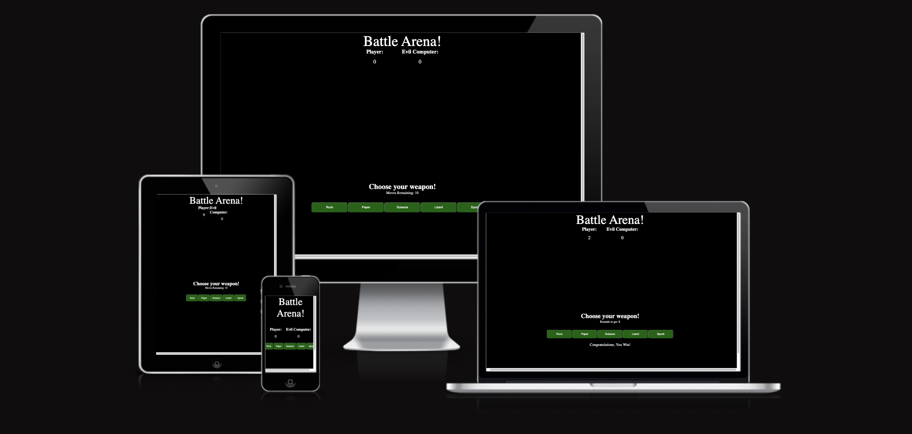
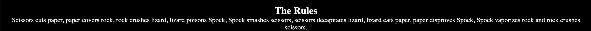
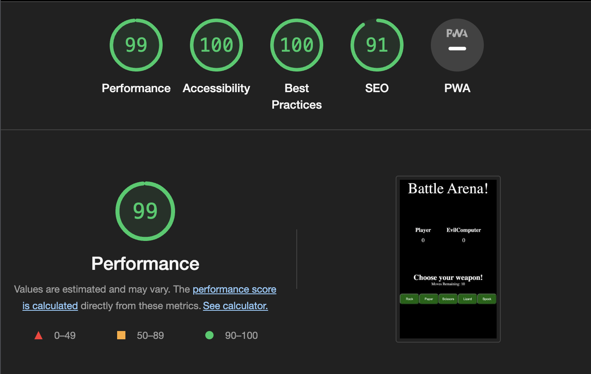

# Rock-Paper-Scissors-Lizard-Spock Game

Rock-paper-scissors-lizard-Spock is a variant of Rock-paper-scissors that allows five choices. Each choice wins against two other choices, loses against two other choices and ties against itself. Much of Rock-Paper-Scissors-Lizard-Spock's popularity is that it has been featured in 3 episodes of the TV series "The Big Bang Theory".

### Existing Features

- __Game Heading__

  - Featured at the top of the site, the heading tells the user that they have entered the battle arena.

- __Score Tally__

  - The game includes a tally showing the user what score they are on before the game ends after 10 turns.
  - This section provides the user information on what score they and the computer are on.

- __Choose Your Weapon!__

  - This heading indicates to the user to choose a weapon of either: rock, Paper, Scissors, Lizard, Spock.

- __Moves Remaining__

  - The game includes a moves remaining bar that shows how many moves are left until the game is over.
  - This indicates how many more chances the user has to finish the game.

- __The Choices__

  - The options are Rock, Paper, Scissors, Lizard, Spock.
  - This bar is where the player has interactive buttons that can be chosen in order to play against the computer. The resulting option will lead to a display of who has won if anyone. 

 

- __The Footer__ 

  - The Footer shows the clear rules of the game and explains how to play Rock, Paper, Scissors, Lizard, Spock. 

## Testing 

- I have tested this game in multiple browsers including: Chrome, Safari and Firefox.
- I can confirm the game always ends in the correct way and behaves accordingly.
- I can confirm all text is easily readable and easy to understand.
- I have run it through lighthouse and have determined that all colors and fonts are easy to read and accessible.

### Validator Testing 

- HTML
  - No errors were returned when passing through the official after 3 modifications were made. [W3C validator].
- CSS
  - No errors were found when passing through the official [(Jigsaw) validator].

### Unfixed Bugs

No unfixed bugs left.

## Deployment

This section should describe the process you went through to deploy the project to a hosting platform (e.g. GitHub) 

  - The site was deployed to GitHub pages. The steps to deploy are as follows: 
  - In the GitHub repository, navigate to the Settings tab.
  - From the source section drop-down menu, select the Master Branch.
  - Once the master branch has been selected, the page will be automatically refreshed with a detailed ribbon display to indicate the successful deployment. 

The live link for my site is as follows: https://te-jay101.github.io/Rock-Paper-Scissors-Lizard-Spock/

## Credits 

### Content 

- Used geeksforgeeks.org to help with aspects of css.

### Media

- Favicon taken from icons8.com.

