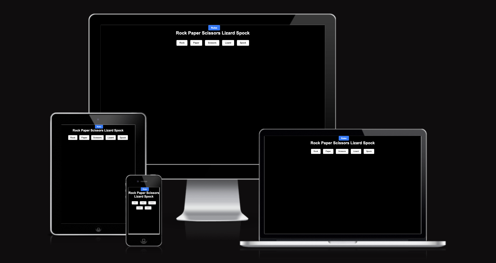
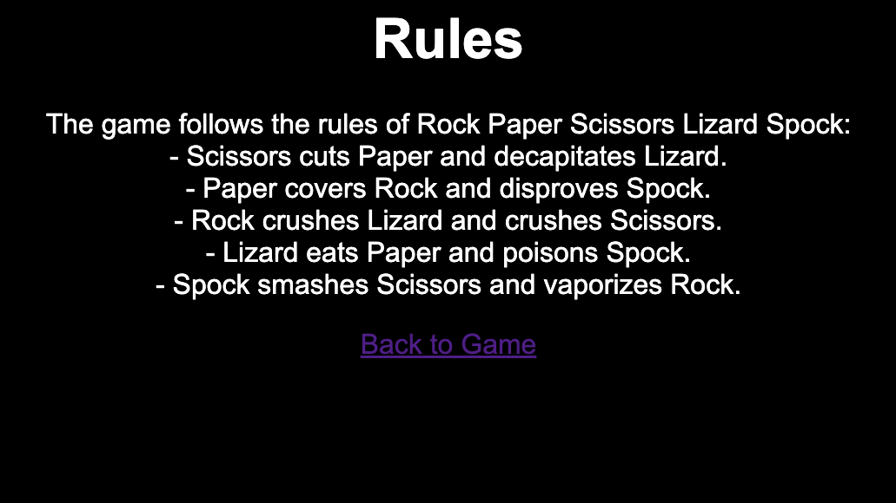
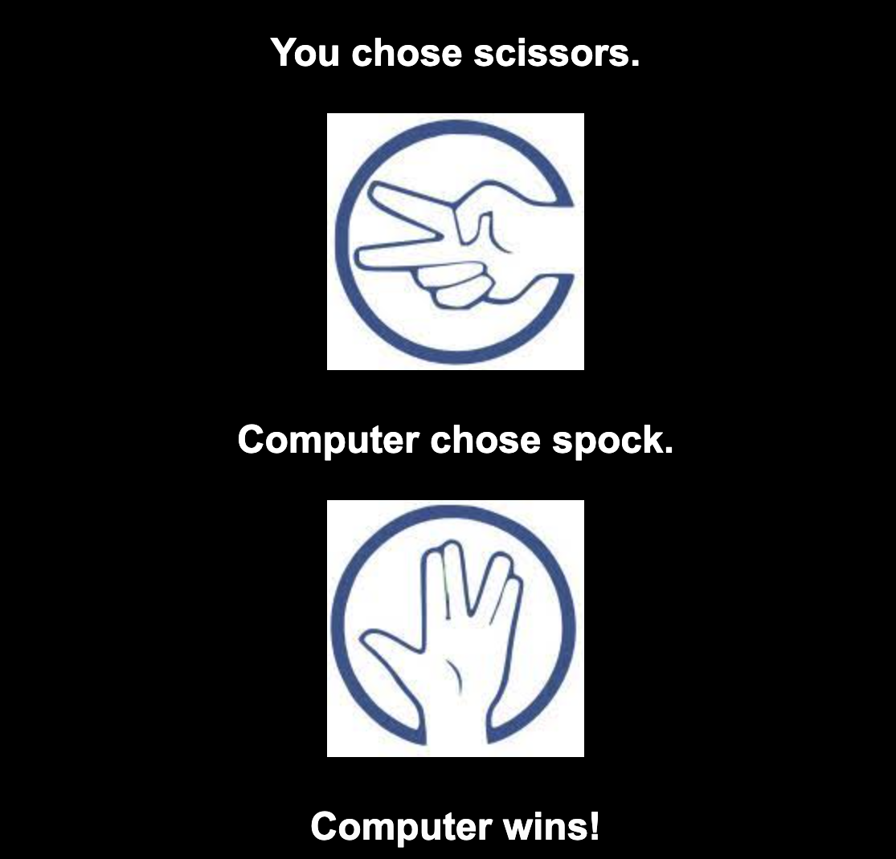
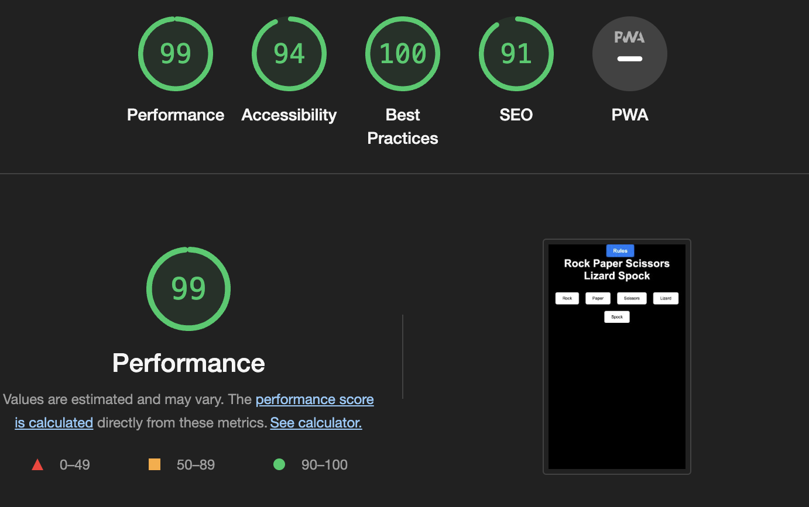

# Rock-Paper-Scissors-Lizard-Spock Game

Rock-paper-scissors-lizard-Spock is a variant of Rock-paper-scissors that allows five choices. Each choice wins against two other choices, loses against two other choices and ties against itself. Much of Rock-Paper-Scissors-Lizard-Spock's popularity is that it has been featured in 3 episodes of the TV series "The Big Bang Theory".

### Existing Features

- __The Rules__

  - Featured at the top of the site.
    - A link that take you to the rules page.
    - Clearly explains the rules of the game to the user.

- __Heading__

- The title of the page.
  - Positioned at the top of the page just below the rules tab, clearly positioned that contrasts witht he background.
  - The header clearly tells the user what the game is.

 

- __Make a Choice__

  - The option boxs are clearly positioned for the user to make a choice in the game.
    - Interactive buttons that the player can select to play against the computer.

- __The Winner__

  - The options are Rock, Paper, Scissors, Lizard, Spock.
    - This bar is where the player has interactive buttons that can be chosen in order to play against the computer. The resulting option will lead to a display of who has won if anyone. 
    - Making a choice will present 2 pictures in browser that shows your choice vs the computers and declare a winner.

 

## Testing 

- I have tested this game in multiple browsers including: Chrome, Safari and Firefox.
- I can confirm the game always ends in the correct way and behaves accordingly.
- I can confirm all text is easily readable and easy to understand.
- I have run it through lighthouse and have determined that all colors and fonts are easy to read and accessible.

### Validator Testing 

- HTML
  - No errors were returned when passing through the official after 3 modifications were made. [W3C validator].
- CSS
  - No errors were found when passing through the official [(Jigsaw) validator].
- Java
  - No errors other than esversion: 6 error.

### Unfixed Bugs

No unfixed bugs left.

## Deployment

This section should describe the process you went through to deploy the project to a hosting platform (e.g. GitHub) 

  - The site was deployed to GitHub pages. The steps to deploy are as follows: 
  - In the GitHub repository, navigate to the Settings tab.
  - From the source section drop-down menu, select the Master Branch.
  - Once the master branch has been selected, the page will be automatically refreshed with a detailed ribbon display to indicate the successful deployment. 

The live link for my site is as follows: https://te-jay101.github.io/Rock-Paper-Scissors-Lizard-Spock/

## Credits 

### Content 

- Used geeksforgeeks.org to help with aspects of css.
- Code Institutes project rock paper scissors.

### Media

- Favicon taken from icons8.com.
- Pictures taken from google images.

